<h1 align="center">🍀 Hello! I'm Dymes! 🍀</h1>
<h3 align="center">A Computer Science student exploring the programming world.</h3>
<h4 align="center">"The universe is under no obligation to make sense to you"    - Neil deGrasse Tyson</h4>

  

- 🏢 Worked at **CeniXys** for 7 months
- 🏅 PhilNITS FE certified
- 💻 Learning about **Intelligent Systems, Software Engineering,** and **Blockchain Development**
- 🔨 Building a lightweight, codebase-integrated 2D Java Engine and a separate, complementary Level Editor

<h3 align="Center">Connect with me:</h3>

  
  
  

<h3 align="Center">Languages and Tools:</h3>

  

 

