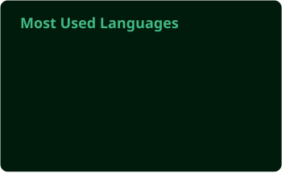

<h1 align="center">🍀 Hello! I'm Dymes! 🍀</h1>
<h3 align="center">I really like creating software. I love the art of programming.</h3>
<h4 align="center">"The universe is under no obligation to make sense to you"    - Neil deGrasse Tyson</h4>
<!-- 
  
 -->

**Who, What, Where, When, and Why**
- 💼️ Currently an intern at **Symph Inc.**
- 🏅 **PhilNITS** FE certified
- 🏢 Worked at **CeniXys**, **DOST**
- 🎓️ 2027, Final Project: AI-integrated teleradiology **TB screening platform**
- 🔨 Building a custom **2D Java Engine and Editor** for a passion project

**Fun Facts**
- 💚️ I love my wife
- 🍀 Huge Celtics fan
- ☠️ I like collecting Monster cans

<!-- <h3 align="Center">Connect with me:</h3>

&nbsp;&nbsp;&nbsp;&nbsp;
 -->

<h3 align="Center">Environments, Languages, and Tools:</h3>

  

&nbsp;&nbsp;&nbsp;&nbsp;

<!--[Dym's GitHub stats](./generated/overview.svg) 

